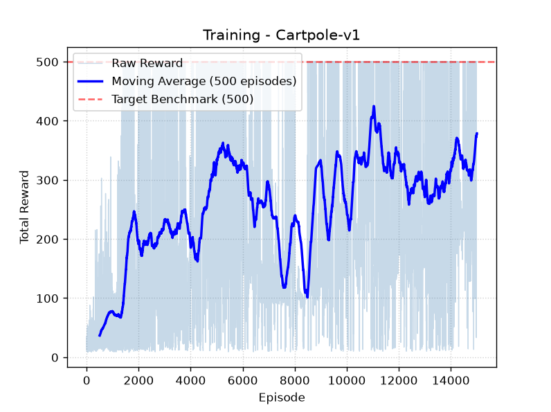

# CartPole DQN

Implémentation d'un agent de reinforcement learning résolvant l'environnement `CartPole-v1` de Gymnasium, avec Deep Q-Network (DQN) et sa variante Double DQN, Experience Replay, et un système d'évaluation/sauvegarde du meilleur modèle.

## Le problème

CartPole est un pendule inversé : un chariot mobile sur un rail horizontal porte un bâton fixé par une articulation libre, non motorisée. Le bâton tombe sous l'effet de la gravité, et l'agent doit déplacer le chariot à gauche ou à droite pour le maintenir en équilibre le plus longtemps possible (500 steps maximum par épisode).

**État observé (4 valeurs)** : position du chariot, vitesse du chariot, angle du bâton, vitesse angulaire du bâton.

**Actions possibles (2)** : pousser le chariot à gauche, pousser le chariot à droite.

**Reward** : +1 par step tant que l'épisode continue.

L'agent ne reçoit aucune règle physique explicite : il apprend uniquement par essai-erreur, en observant l'état et en étant récompensé (ou non) selon la durée de survie de l'épisode.

## Architecture

- `network.py` : réseau de neurones (MLP) : `Input(4) → Linear(64) → ReLU → Linear(64) → ReLU → Linear(2)`. Prend l'état en entrée, ressort une Q-value par action possible.
- `replay_buffer.py` : mémoire tampon (deque) stockant les transitions `(state, action, reward, next_state, done)`, échantillonnées aléatoirement par batch pour décorréler les données d'entraînement.
- `agent.py` : logique de décision (epsilon-greedy), boucle d'entraînement (Double DQN), gestion du réseau cible.
- `train.py` : boucle d'entraînement principale, évaluation périodique, sauvegarde du meilleur modèle.
- `demo.py` : charge le meilleur modèle sauvegardé et l'exécute en rendu visuel.

## Algorithmes utilisés

**Deep Q-Network (DQN)** : le réseau apprend à approximer la fonction Q(état, action), qui estime la récompense cumulée espérée pour une action donnée dans un état donné. La mise à jour repose sur l'équation de Bellman : la valeur d'une action est le reward immédiat plus la valeur estimée du meilleur coup suivant.

**Double DQN** : pour éviter la surestimation systématique des Q-values (un biais connu du DQN classique), la sélection de la meilleure action suivante et l'évaluation de sa valeur sont séparées entre deux réseaux : le réseau principal (`q_network`) choisit l'action, le réseau cible (`target_network`) l'évalue.

**Experience Replay** : les transitions sont stockées puis rejouées dans un ordre aléatoire, ce qui casse la corrélation temporelle entre les données successives d'un même épisode et stabilise l'apprentissage.

**Réseau cible (target network)** : une copie du réseau principal, mise à jour périodiquement (et non à chaque step), qui sert à calculer une cible de Bellman stable. Sans lui, le réseau chasserait une cible qui bouge à chaque mise à jour, ce qui déstabilise fortement l'entraînement.

## Historique des problèmes rencontrés et solutions

Cette section documente les itérations successives sur le projet : les bugs identifiés, les hypothèses testées, et ce qui a fonctionné ou non.

### Bugs d'implémentation initiaux

Plusieurs erreurs classiques ont été rencontrées et corrigées lors de la première implémentation :

- **Types de tenseurs incohérents** : `actions` devait être un `LongTensor` (et non `FloatTensor`) pour fonctionner avec `gather()`. De même, `states`, `next_states` et `rewards` devaient tous être explicitement castés en `float32` pour être cohérents avec les poids du réseau (par défaut en `float32`), sous peine de mélanges de types silencieux (calculs valides mais plus lents, en `float64`).
- **`np.argmax` sur un tenseur PyTorch** : ne fonctionne pas comme attendu sur une sortie de réseau ; il faut utiliser `.argmax().item()` pour récupérer un entier Python natif.
- **`max()` Python natif sur un tenseur 2D** : ne fait pas ce qu'on attend sur une sortie de shape `(batch_size, n_actions)` ; il faut `.max(dim=1)[0]` pour obtenir le maximum par ligne.
- **Calcul de la loss et backpropagation dans un bloc `torch.no_grad()`** : cette erreur empêche tout calcul de gradient, donc tout apprentissage. Seuls le calcul de la cible de Bellman (`target`) doit être fait sans gradient ; le calcul de la loss, `backward()` et `optimizer.step()` doivent impérativement rester en dehors.

### Instabilité de l'entraînement : la courbe qui redescend

Un premier run complet montrait une courbe de performance montant jusqu'à un pic proche de 500, puis **redescendant** progressivement jusqu'à environ 100, malgré un Double DQN fonctionnel.

**Cause identifiée** : `eps_min` (le plancher d'exploration aléatoire) était fixé à 0.1, soit 10 % de chance d'action aléatoire à chaque step, même une fois l'agent devenu compétent. Sur un épisode de 500 steps, la probabilité qu'aucune des actions ne soit aléatoire est `0.9^500 ≈ 1.4 × 10⁻²³` : donc statistiquement impossible de tenir un épisode long sans qu'une action aléatoire malheureuse ne fasse tomber le bâton.

**Solution** : abaisser `eps_min` à 0.01. Résultat : la courbe est devenue monotone croissante, sans effondrement, confirmant que l'excès d'exploration résiduelle était bien la cause principale de cette instabilité particulière.

### Optimisation de la vitesse d'entraînement

L'entraînement initial (4000 épisodes) prenait environ 10 minutes. Plusieurs pistes ont été explorées :

- **GPU** : écarté pour ce projet. Le réseau (deux couches de 64 neurones) est trop petit pour que le calcul sur GPU compense le coût de transfert CPU↔GPU à chaque batch (le GPU sera pertinent pour Dino Chrome, avec un réseau plus conséquent).
- **Entraînement toutes les N steps (`train_nstep`)** : plutôt que d'appeler l'étape d'entraînement (`forward`, `backward`, `optimizer.step`) à chaque step de l'environnement, elle n'est déclenchée qu'un step sur 4. Les transitions continuent d'être stockées dans le buffer à chaque step ; seule la fréquence de mise à jour des poids est réduite. Il a fallu ajuster `target_update_freq` en proportion (de 250 à 1000) pour garder le même ratio de synchronisation du réseau cible par rapport au nombre réel de mises à jour de poids.

Résultat : temps d'entraînement réduit à environ 4-5 minutes pour un budget d'épisodes équivalent, avec un léger ralentissement de la vitesse d'apprentissage par épisode (compromis attendu, compensé par un budget d'épisodes plus long).

### Instabilité persistante après stabilisation de l'exploration : le catastrophic forgetting

Même une fois `eps_min` corrigé et sur un budget d'épisodes plus long (6000), la courbe continuait à osciller significativement : montée jusqu'à un pic, chute brutale (dans un cas, un passage de 500 à 90 de récompense d'évaluation en seulement 300 épisodes), puis remontée. Ce phénomène persistait même une fois epsilon totalement stabilisé à son plancher, donc l'exploration résiduelle n'en était plus la cause.

**Hypothèses explorées** :

- **Gradient clipping** (limiter l'amplitude des mises à jour de poids via `clip_grad_norm_`) : testé à `max_norm=10` puis `max_norm=100`. Aucune des deux valeurs n'a résolu l'oscillation ; à `max_norm=10`, la performance maximale atteinte était même plus basse (~260 contre ~360 sans clipping). Conclusion : la taille brute des gradients n'était pas la cause principale de l'instabilité observée ici.
- **Diversité du buffer de replay** : hypothèse retenue comme cause la plus probable. Lorsque l'agent enchaîne plusieurs bons épisodes (300 à 500 steps), le buffer (capacité 10 000) se remplit majoritairement de transitions très similaires (l'agent en équilibre stable), au détriment de la diversité de situations (débuts d'épisode, récupérations, échecs). Le réseau, en s'entraînant sur ce buffer déséquilibré, peut dégrader une bonne politique déjà acquise : un phénomène connu sous le nom de *catastrophic forgetting*.

**Conclusion sur ce point** : cette oscillation est un comportement documenté et attendu d'un DQN vanilla, pas un bug de code. Plutôt que de chercher à supprimer l'oscillation, la stratégie retenue a été de s'en accommoder via un mécanisme de sauvegarde du meilleur modèle.

### Évaluation périodique et sauvegarde du meilleur modèle

Pour ne pas dépendre d'un entraînement parfaitement stable, une méthode `evaluate()` a été ajoutée à l'agent : elle fait tourner un nombre fixe d'épisodes en pur mode exploitation (sélection d'action par `argmax`, sans aucune action aléatoire), et retourne la récompense moyenne obtenue : une mesure propre de la qualité réelle de la politique apprise, non polluée par le bruit de l'exploration résiduelle.

Cette évaluation est exécutée à intervalles réguliers pendant l'entraînement. Le modèle n'est sauvegardé sur disque que si son score d'évaluation dépasse le meilleur score observé jusque-là. Ainsi, même si l'entraînement continue d'osciller après avoir atteint un pic, le modèle final conservé correspond au meilleur point réellement atteint, pas au dernier état du réseau, qui peut très bien se trouver dans un creux de performance au moment où l'entraînement s'arrête.

### Vérification de la généralisation

Une observation initiale du modèle en démonstration (`demo.py`) donnait l'impression que l'agent reproduisait toujours le même mouvement (le bâton penchant systématiquement du même côté avant correction). Pour vérifier s'il s'agissait d'un comportement mémorisé plutôt qu'une vraie politique réactive à l'état observé, l'état initial a été forcé manuellement à un angle penché dans l'autre sens.

**Résultat** : l'agent corrige immédiatement dans la bonne direction face à ce nouvel état, confirmant qu'il réagit bien à l'état observé et non à une règle fixe mémorisée. Cependant, en forçant un angle important sans vitesse angulaire cohérente (une combinaison d'état jamais rencontrée en conditions normales, où `env.reset()` ne génère qu'un bruit initial très faible), l'agent peut ensuite perdre le contrôle plus loin dans l'épisode : signe attendu et normal qu'un réseau de neurones généralise moins bien en dehors de la distribution des états rencontrés à l'entraînement, pas un défaut d'implémentation.

## Courbe d'entraînement



*Moyenne glissante (bleu foncé) sur 500 épisodes, superposée aux rewards bruts par épisode (bande bleu clair). On observe que l'oscillation entre phases de bonne et moins bonne performance persiste même après 15000 épisodes — d'où l'importance du mécanisme d'évaluation et de sauvegarde du meilleur modèle plutôt que de compter sur une convergence stable de l'entraînement.*

## Modèle final

Le modèle actuellement sauvegardé (`best_model.pth`) atteint la récompense maximale de 500 sur `CartPole-v1`, y compris lorsqu'il est confronté à des conditions de départ légèrement forcées et différentes de la distribution d'entraînement standard, ce qui indique une politique généralisant correctement sur l'ensemble de l'espace d'états pertinent du problème.

## Utilisation

```bash
# Entraîner l'agent (sauvegarde automatique du meilleur modèle)
python train.py

# Regarder l'agent jouer avec le meilleur modèle sauvegardé
python demo.py